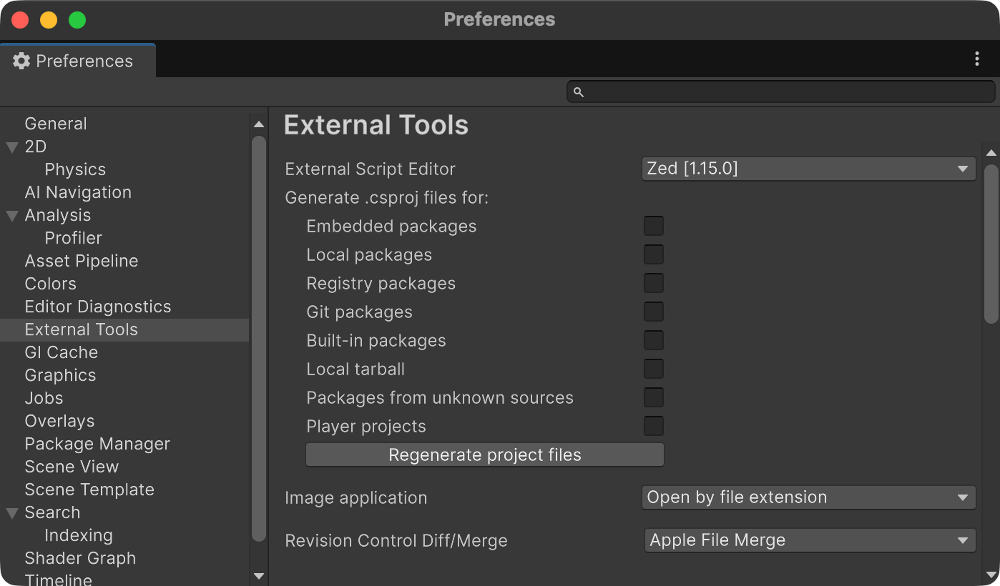

# UnityZedEditor
Code editor integration for supporting Zed as code editor for Unity

[](./LICENSE)




[English](README.md) | 日本語

## 概要

UnityZedEditorはUnityでZedを利用するためのエディタ拡張です。External Script EditorにZedを設定できるようにするほか、`.slnx`/`.csproj`や`.zed/settings.json`の初期設定を自動生成する機能を提供しています。

## 要件

- Unity 2021.3 以上
- `com.unity.ide.visualstudio` 2.0.26 以上
  - これは実装上の都合で必要とされる依存関係です。機能の大部分は`Microsoft.Unity.VisualStudio.Editor`を公開APIを利用して実装されています。

## インストール

### Unity

`Window > Package Management > Package Manager`を開き、`"+" > Install package from git URL...`を押して以下のURLを入力します。

```
https://github.com/nuskey8/UnityZedEditor.git
```

または、`Packages/manifest.json`を開き、`dependencies`に以下の1行を追加します。

```json
"com.nuskey8.ide.zed": "https://github.com/nuskey8/UnityZedEditor.git?path=Assets/UnityZedEditor",
```

### Zed CLI

UnityZedEditorを利用するにはZedのCLIが必要です。以下の手順に従ってセットアップを完了させてください。

https://zed.dev/docs/reference/cli

## 機能

UnityZedEditorをプロジェクトに追加することで、External Script EditorにZedを設定できるようになります。これにより以下の機能が利用可能になります。

- UnityエディタでC#スクリプトを開いたときにZedを起動させる
- Consoleのログをダブルクリックした際に対象のファイルをZedで開く
- 初回起動時にUnityプロジェクト向けの`.zed/settings.json`を生成する
- `.csproj`/`.slnx`の自動生成や、手動での再生成

## ライセンス

[MIT](LICENSE)